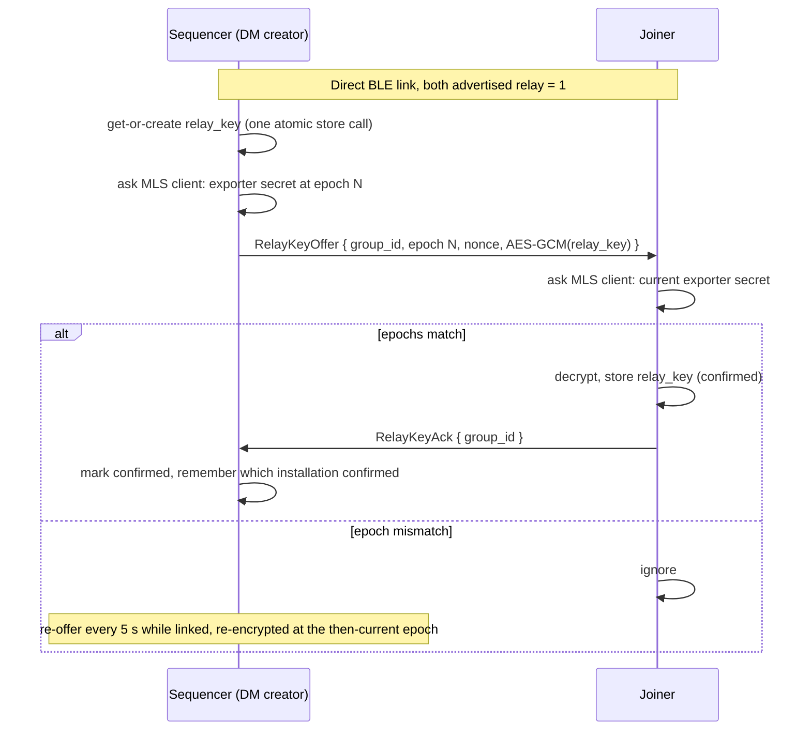

# xmtp-mesh design

xmtp-mesh runs XMTP v3 (MLS) messaging over a Bluetooth Low Energy mesh, with
no internet and no XMTP nodes. Messages are real XMTP MLS messages; only the
transport changes. libxmtp's network API client is replaced by an in-process
node that syncs peer to peer over BLE.

Status: **experimental, not audited.** Do not describe it as protest-safe:
see §R9 and §B14.7 for what a nearby listener can still learn.

This document has three parts:

- **Part B — Base mesh** (§B1–§B14): the direct, one-hop mesh. Two phones in
  BLE range sync DMs.
- **Part C — Restore convergence** (§C1–§C7): what happens when an inbox's
  identity log forks after a restore, and how every node converges on one log.
- **Part R — Multi-hop relay** (§R1–§R11): sealed envelopes that other phones
  carry and forward.

## How to cite this document

- **Sections:** `§` + part letter + section number, e.g. `§B5.2`, `§C4.1`,
  `§R5.4`. The part letter makes every section id unique across the document.
- **Decisions:** `D` + number, e.g. `D17`. Decision ids are global, unique and
  never renumbered. Each is defined in exactly one decision table (§B2, §C2 or
  §R3).
- **Ordering rules:** "Rule A", "Rule B" and "Rule C" are defined in §B5.2.

Code comments in this fork cite this document in that form ("DESIGN.md §R4.5",
or just "§R4.5" inside the `xmtp_mesh` crate).

---

# Part B — Base mesh

## B1 Purpose and scope

1:1 messaging that works with **no internet and no XMTP nodes**: festivals,
disasters, protests (not to be described as protest-safe; see §R9), places where the
internet is blocked. The first app built
on it is PyriteChat, a React Native app; this document refers to it as "the
app".

Goals of the base mesh:

1. Two Android phones that have never been online can each onboard, pair in
   person, and exchange end-to-end encrypted DMs over BLE.
2. Messages written while the peer is out of range are queued and delivered
   automatically when the peer comes back into range.
3. No network request to any XMTP node, or any server, is made at any point.
4. libxmtp's MLS, identity and crypto code stays as upstream as possible. The
   mesh is a new transport; the few upstream edits are listed in `PATCHES.md`.

## B2 Decisions

| # | Decision | Deferred or rejected alternative |
|---|---|---|
| D1 | 1:1 DMs only | Public nearby rooms (broadcast) |
| D2 | Direct peer to peer (both phones in BLE range) in the base mesh; multi-hop is Part R | Store-and-forward on the base link |
| D3 | App-generated EOA key; inbox created offline | Linking an external wallet |
| D4 | Real XMTP MLS messages over the mesh, via a libxmtp fork | Separate mesh crypto (rejected) |
| D5 | Mesh only; never contacts XMTP nodes | Optional XMTP-network bridge |
| D6 | BLE, cross-platform capable | Wi-Fi Direct / Wi-Fi Aware fast path |
| D7 | One installation (device) per inbox | Multi-device (needs an ordered, multi-writer identity log) |
| D8 | Android first; nothing may block iOS later | iOS BLE radio |
| D9 (replaced by D31–D36, §B14) | Simple discovery: fixed service UUID, inbox ids in a cleartext `Hello` | Rotating HMAC tokens + Noise handshake (now §B14), then per-contact keys |
| D10 | All protocol logic lives in Rust (`xmtp_mesh`); platform radios only move bytes | Protocol logic per platform |
| D20 | One mesh node per inbox on a device, following the libxmtp database (§B10.1) | One node per app install |
| D21 | When a node rotates for a new installation of a known inbox, carry the inbox's identity log into the new node (§B10.2) | Let peers accept a second `CreateInbox` (that is Part C, for the case with no old node) |
| D22 (replaced by D32, §B14.2) | The BLE short id is per node (inbox + generation), not per install; the old install-wide id is deleted, never migrated (§B10.3) | One short id per install (links every identity the install ever used) |
| D23 | A link with no inbound packet for 24 s is closed; idle links are pinged every 8 s (§B7.3) | Trust the platform's "connected" state |
| D30 | Every sequenced row carries a signature by the installation that ordered it, over a record shaped like XMTP d14n's originator envelope; every node checks it before storing a row, and mesh.10 syncs only with mesh.10 (§B13) | A signature per frame (lost once rows are stored); a hash chain (broken by §C4.7 id reuse); a mixed-version transition period |
| D31 | Strangers learn nothing linkable: a relay link is Noise NN with fresh keys, carries only relay frames, is short-lived, and gets per-link and per-window relay budgets (§B14.3, §B14.5, §R5.4) | A relay identity key (trackable); XX with the installation key (names the phone) |
| D32 | One discovery key per phone, shared with every contact; advert token = first 8 bytes of HMAC-SHA256(discovery key, 15-minute window); advert and address rotate together; the lower token dials (§B14.2) | Per-contact keys (the advert has room for one token); a fixed short id (D22) |
| D33 | Contact links use Noise IK, accepted only from a live contact, or during a restore window from a static that is no removed contact's; pairing uses Noise XX on throwaway static keys with a commit-then-reveal 6-digit code, and the real static travels in the contact card once both people confirmed (§B14.3, §B14.4, §B14.7) | Noise KK (a restored phone that lost its contacts could not answer); XX everywhere, or pairing XX with the real static (shows the static to whoever answers); accepting any IK dialer while a phone has no contacts (a stranger holding the static becomes a contact) |
| D34 | The Noise static key and the generation-0 discovery key are derived from the account key the recovery phrase restores; every discovery reset mixes in a random salt stored on the phone (§B14.1) | Random keys (a restored phone could not be recognised or dialed); resets derived from the generation alone (a restore brings back every key an ex-contact held) |
| D35 | Contact and relay links look alike on the air: every first message is 128 bytes, message 2 is the same size, every record is padded to a size bucket, stale or replayed IK is answered like a stranger, and the responder tries IK, then NN (§B14.2, §B14.3) | Distinct first messages or exact record sizes (a sniffer learns who are contacts, and recognises a phone by the size of its identity log) |
| D36 | Hard cut: mesh.11 talks only to mesh.11 (advert version 2, Noise prologue `xmtp-mesh-link-v1`, `Hello.link = 1`, Auth text v2) | A transition period |

### Private discovery (D31–D36)

D9's cleartext `Hello` and fixed short id are replaced by rotating advert
tokens and Noise links (§B14). What a nearby listener can still learn is in
§B14.7 and §R9; the mesh must still not be described as protest-safe.

## B3 Facts about libxmtp the design rests on

- **There is a transport seam in Rust.** `xmtp_mls` talks to the network only
  through the `XmtpMlsClient`, `XmtpMlsStreams` and `XmtpIdentityClient` traits
  (`crates/xmtp_proto`), selected when the API client is built. Swift, Kotlin
  or JS cannot inject a transport, so the replacement must be Rust.
- **Identity is self-verifying.** Identity updates are re-verified locally
  (ERC-191 recovery for EOAs, ed25519 for installations), and `inbox_id` is a
  local hash. Only smart-contract wallets need a remote verifier, and the mesh
  does not support them.
- **Ordering is the real risk.** Nodes assign cursors; the client treats query
  order as authoritative, skips anything at or below its cursor, and cannot
  roll back an applied commit. Concurrent commits applied in different orders
  fork a group permanently. `GroupMembership` also pins identity-update
  `sequence_id`s into MLS state, so peers must agree on identity-log indices.
- **Build.** The Android and iOS SDKs live in the libxmtp monorepo (`sdks/`).
  The React Native SDK 5.7.0 pins native `4.10.0-rc2`, so this fork branches
  from the `android-4.10.0-rc2` tag, not from HEAD.

## B4 Architecture

```
┌─────────────────────────────────────────────┐
│ App (React Native)                          │  onboarding, pairing, chats
├─────────────────────────────────────────────┤
│ @xmtp/react-native-sdk (fork)               │  env 'mesh' (Android); iOS throws
├─────────────────────────────────────────────┤
│ xmtp-android (sdks/android in this fork)    │  Kotlin BLE radio: implements MeshTransport
│        ▲ bytes in/out (uniffi callbacks)    │
├────────┼────────────────────────────────────┤
│ libxmtp (Rust, this fork)                   │
│   xmtp_mls           (few edits, PATCHES.md)│
│   V3 API client      (unmodified)           │
│   MeshNode: in-process v3 node              │
│   xmtp_mesh crate    store, sync, ordering  │
└─────────────────────────────────────────────┘
```

1. **`xmtp_mesh` (new crate).** Envelope store (its own SQLCipher database),
   per-topic ids, the sync protocol and the ordering rules. It owns all
   protocol logic, so a future iOS radio adds no logic (D10).
2. **`MeshNode`.** Implements libxmtp's low-level transport trait as an
   in-process emulation of an XMTP v3 node: requests arrive as
   `(gRPC path, protobuf bytes)` and are answered from `xmtp_mesh`. libxmtp's
   own V3 client (cursor store, extractors, paging, streams) runs unchanged on
   top. The bindings gain `connect_to_mesh(...)` beside `connect_to_backend`.
3. **`MeshTransport` (uniffi callback interface).** A platform-neutral byte
   pipe: `send(peer_id, bytes)` is implemented natively; `on_peer_connected`
   (with how the link opened, §B14.3), `on_peer_lost` and
   `on_bytes(peer_id, bytes)` call into Rust. Message bytes
   never cross the JS bridge.
4. **Android BLE radio (Kotlin).** Dual role (advertise + scan, GATT server +
   client), MTU negotiation, chunking, a foreground service. Moves bytes only.
5. **React Native SDK fork.** Adds `env: 'mesh'`, peer-presence events and the
   relay API, and depends on the AAR built from this fork. `mesh` on iOS
   throws "unsupported".

## B5 Envelope and sync protocol

### B5.1 Frames

Everything two nodes say to each other is a protobuf `Frame`
(`crates/xmtp_mesh/src/sync/frames.rs`):

```
Frame { version: u32 = 1, ttl: u32, hops: u32, body: oneof Body }
```

`ttl` and `hops` were reserved for multi-hop and are always 0: relay uses its
own envelope instead (§R1). `decode` rejects any other `version` and any frame
over 1 MiB. List-bearing frames are paged at 64 messages or 128 KiB (a single
larger message goes alone).

On the air, frames travel only inside an open Noise link, sealed as records
(§B14.3). The first frame of a link is sent after its handshake, by the
dialer.

| Tag | Body | Purpose |
|---|---|---|
| 10 | `Hello{installation_key, inbox_id, challenge, relay, seq, link}` | Start of the handshake inside a contact or pairing link (§B5.3). `relay`: relay version (§R7); `seq`: signed-sequencing version (§B13); `link`: link version (1; a peer below it is refused, §B14.4). |
| 11 | `Auth{signature, challenge}` | Answers the peer's challenge. |
| 12 | `IdentityLog{inbox_id, updates}` | An inbox's identity log. |
| 13 | `KeyPackage{installation_key, key_package}` | The sender's own key package. |
| 14 | `Welcome{envelope_hash, input}` | A welcome for the receiving installation. |
| 15 | `WelcomeAck{envelope_hash}` | The receiver stored the welcome; the sender drops its outbound copy. |
| 16 | `Interest{group_id, high_id, i_am_sequencer}` | "I know this group up to id N" (pull sync). |
| 17 | `Sequenced{group_id, messages, sender_is_sequencer, proofs}` | Sequenced group messages, each with its sequencing proof (`proofs[i]` for `messages[i]`, §B13). |
| 18 | `Pending{group_id, messages}` | Unsequenced messages for the sequencer. |
| 19 | `IdentityConflict(IdentityLog)` | "My log of this inbox beats yours" (§C4.2). |
| 20–24 | `Relay`, `SpoolDigest`, `SpoolWant`, `RelayKeyOffer`, `RelayKeyAck` | Multi-hop relay (§R4.1). Only 20–22 may travel on a relay link (§B14.3). |
| 25 | `ContactCard{inbox_id, noise_static_pub, discovery_key, generation}` | A contact's discovery card (§B14.4). Contact and pairing links only. |
| 26 | `PairConfirm{}` | "My person confirmed the pairing code" (§B14.4). The only frame a pairing link carries until both people confirmed. |

An existing tag is never renumbered. An older node decodes an unknown body as
an empty frame, a non-fatal error that the session logs and ignores.

### B5.2 Ordering rules

- **Rule A — DM sequencer.** Every group has one sequencer installation that
  assigns the final order (the `id`) of every group message, commits and
  application messages alike. For a DM it is the **creator**: the installation
  whose node first sees a local publish at MLS **epoch 0** (the creation
  commit). Creator rather than, say, lower inbox id, because libxmtp publishes
  the group's first commit *before* it sends the welcome, so at that moment
  the creator's node cannot know the peer. The joiner learns the sequencer as
  the sender of the welcome, or trust-on-first-use from a member's
  `Interest`/`Sequenced` frame. A local publish at epoch > 0 for a group with
  no known sequencer waits in pending until one is pinned. Simultaneous mutual
  DM creation yields two groups, each with its own creator; libxmtp already
  stitches duplicate DMs. If the pinned sequencer's installation is revoked,
  the role moves to the other member (§C4.7).
- **Membership gate (part of Rule A).** All group traffic is scoped by real
  group membership as the local libxmtp client sees it. A peer is pinned as
  sequencer, sent a group's `Interest`, served `Sequenced` history, sent
  pushes, or allowed to submit `Pending` only if its **verified** inbox (its
  installation is in that inbox's identity log) is a member of that group and
  is not our own inbox. While the local client does not know the group yet
  (a joiner that has not processed the welcome, a creator that has not merged
  the commit), the claim is remembered and re-checked every 500 ms for up to a
  minute, and on every later frame about the group, never pinned blindly. So
  a verified stranger (anyone can create an inbox offline), even one that
  delivered a welcome, learns no group ids, cannot pin itself as sequencer,
  cannot get junk sequenced and cannot pull ciphertext history.
- **Rule B — identity log.** Each inbox numbers its own identity-update log
  1, 2, 3 … A node appends a peer's updates contiguously after the last
  sequence it holds. Safe only under D7 (one installation writes the log).
  Part C handles two logs of one inbox that differ.
- **Rule C — key packages.** Each node hands a peer only its own
  installation's key package, at the handshake, and caches the peer's. Pairing
  is in person, so both phones already hold each other's key package when a DM
  is created. Last-resort key packages are reusable.

### B5.3 Sync session

A session starts when the radio reports a link (`on_peer_connected(peer,
role)`) and ends when the link is lost. Each link gets a fresh,
connection-scoped `PeerId`. The session first runs the link's Noise handshake
(§B14.3). A relay link then carries relay frames only; a contact link runs
the steps below inside the encrypted link, and a pairing link runs them once
both people confirmed the code (§B14.4).

1. **Handshake.** Each side sends `Hello{its installation key, a fresh
   challenge}` and answers the other's Hello with `Auth`: a signature, with its
   installation key, over a text that binds the peer's challenge and both
   installation keys. A Hello carrying our own key is rejected (reflection).
   A Hello received before we are authenticated makes us re-send ours (a
   bounded number of times), so a lost first Hello does not stall the link. An
   unauthenticated session is closed after the handshake timeout. A Hello
   whose `seq` or `link` is below 1 ends the session (§B13, §B14.4). The
   signed text also binds the link's Noise handshake hash
   (`xmtp-mesh-hello-v2`), so an Auth cannot be moved to another link, and
   on a contact link the Hello must name the inbox the peer's Noise static
   key belongs to (§B14.4).
2. **Identity.** Each side sends its own inbox's `IdentityLog` and its
   `KeyPackage`. The peer is **verified** once its authenticated installation
   is in its claimed inbox's log (§C4.2 covers logs that differ). A peer that
   is not a member within the verification deadline (10 s) is disconnected;
   `PeerNotMember` is fatal.
3. **Welcomes.** Queued welcomes for the peer's installation are delivered and
   acknowledged with `WelcomeAck`.
4. **Interest.** For each group the peer may hear about (the membership gate,
   §B5.2), each side sends `Interest{group_id, high_id, i_am_sequencer}`.
5. **Fill and sequence.** The sequencer answers with `Sequenced` rows after
   the peer's `high_id`; the joiner sends its unsequenced messages as
   `Pending`; the sequencer assigns ids, signs and persists the rows and
   pushes them back; every row travels with its proof and is checked before
   it is stored (§B13).
6. **Live.** While connected, new rows stream immediately on the same path.

"Authenticated" means: *a live holder of installation key K answered through
this Noise link*, and the link's handshake hash is in the signed text (§B12).

### B5.4 Node endpoint mapping (v3 gRPC paths)

| Endpoint | Mesh behaviour |
|---|---|
| `MlsApi/SendGroupMessages` | Parse each MLS message for `group_id` and `is_commit`. Sequencer: assign the next `id` now. Otherwise: pending until synced to the sequencer. |
| `MlsApi/QueryGroupMessages` | Sequenced messages with `id > id_cursor`, ascending or descending, with `limit`. |
| `MlsApi/SendWelcomeMessages` | Outbound until delivered to the recipient installation; the recipient's node assigns the `id` on receipt. |
| `MlsApi/QueryWelcomeMessages` | Welcomes for our installation with `id > id_cursor`. |
| `MlsApi/SubscribeGroupMessages`, `SubscribeWelcomeMessages` | Backlog after the filter cursor, then live. |
| `MlsApi/UploadKeyPackage` | Verify and store; the first upload binds the node to its one local installation for life. |
| `MlsApi/FetchKeyPackages` | Latest stored package per requested installation. |
| `MlsApi/GetNewestGroupMessage` | Last sequenced message per group. |
| `MlsApi/PublishCommitLog`, `QueryCommitLog` | No-op / empty. |
| `IdentityApi/PublishIdentityUpdate` | Verify and append at the inbox's next sequence (Rule B). |
| `IdentityApi/GetIdentityUpdates` | Updates with `sequence_id >` the requested one. |
| `IdentityApi/GetInboxIds` | Identifier → inbox, from the association state of held logs. |
| `IdentityApi/VerifySmartContractWalletSignatures` | `is_valid: false` (EOA only). |

### B5.5 Delivery semantics

libxmtp stores an outgoing message as `Unpublished` and marks it `Published`
only when a query returns it. `send_message` waits for that with bounded
backoff and then fails with `SyncFailedToWait`, leaving the message queued.
Hosts must therefore send optimistically (prepare, then publish) and treat
`SyncFailedToWait` under `mesh` as "queued", not failed. `Unpublished` maps
directly to a "waiting for peer" state in the UI.

## B6 Identity, pairing and discovery

### B6.1 Onboarding (offline)

1. Generate a secp256k1 key and store it encrypted under a platform-keystore
   AES key (Android Keystore cannot sign secp256k1 directly). Wrap it as an
   EOA signer.
2. `inbox_id = sha256(address ‖ nonce)`, computed locally.
3. Create the client, sign the signature text, register the identity: this
   writes identity-log entry 1 to the local node.
4. Upload a key package to the local node.

### B6.2 Pairing (in person)

Pairing is an app concern; the mesh provides what it needs. Both phones
advertise a pairing flag (§B6.3), the phones run a Noise XX link on
throwaway keys and both show a 6-digit code (commit-then-reveal, from its
handshake); the users
compare it and confirm, and only then do the phones exchange identity logs,
key packages and contact cards (§B5.3, §B14.4). Creating the DM then uses
the cached key package; its welcome and commit are sequenced at once because
both phones are present.

### B6.3 Discovery (D32, §B14.2)

The radio advertises the xmtp-mesh service UUID with service data
`version (= 2) ‖ flags ‖ token (8 bytes)`: flag `0x01` pairing mode, `0x02`
relay offered. The token rotates every 15 minutes together with the
advertising address. Only contacts can match it to a phone (§B14.2).

## B7 Radio (Android)

### B7.1 GATT and the link layer

- Dual role: advertise and scan; GATT server and GATT client at once.
- Service `786d7470-6d65-7368-0000-000000000001` ("xmtpmesh" in ASCII). The
  central writes link packets to RX (…0002, write without response); the
  peripheral notifies on TX (…0003).
- Request MTU 517 and adapt to the granted MTU.
- Link packets (big-endian): `Hello{version, token, flags, window}` (the
  token is this phone's current advert token, §B14.2; `window` is the
  flow-control window),
  `Data{msg_id, index, count, payload}`, `Ack{msg_id, index}`, `Probe`,
  `ProbeAck`, `Bye{reason}`. `ReliableLink` gives an ordered, reliable frame
  pipe over one connection: frames are chunked (u16 index/count, so at a small
  MTU the chunk budget caps a frame below 1 MiB — `min(1 MiB, 65535 × (packet
  − 7))`, about 832 KiB at the default MTU 23), acknowledged per chunk with a
  sliding window (default 4, max 16), and reassembled. A frame is handed to
  Rust only when complete; frames are at most 1 MiB, matching `MAX_FRAME_LEN`.
- Permissions: `BLUETOOTH_SCAN`, `BLUETOOTH_ADVERTISE`, `BLUETOOTH_CONNECT`
  (and location on API ≤ 30, notifications on 33+).
- A foreground service of type `connectedDevice` with a persistent
  notification keeps the radio alive in the background.

### B7.2 Scanning and connecting

- Duty-cycled scanning: 10 s on / 20 s off when alone; 10 s on / 5 s off while
  a peer is connected or was seen in the last minute. Android throttles apps
  that start scanning more than 5 times per 30 s, so no cycle is shorter than
  6 s.
- At most 4 concurrent connections. The phone with the lower advert token
  dials (§B14.2); the higher one dials only as a fallback 45 s later, so both
  rarely dial at once.
- Two contact links to one phone (both dialed) are resolved by the node: both
  phones keep the one dialed by the lower Noise static key (§B14.3).
- GATT status 133 (the usual failure) and other connect errors: per-peer
  retry with backoff.
- **Range assumption: 1M PHY (about 10–30 m in crowds).** LE Coded PHY is used
  only when an active probe confirms both phones really receive it;
  `isLeCodedPhySupported()` is not trusted.

### B7.3 Idle liveness (D23)

A BLE "connected" callback does not mean the remote process is still there: if
it restarts, the platform can keep reporting a link as open (a half-open
link). Once a link is ready it tracks the last inbound packet. Idle for 8 s,
it sends a `Probe` (the packet the coded-PHY probe already uses, so every
deployed peer answers it). With nothing inbound for 24 s it closes with reason
"liveness timeout". A duplicate link to a peer is allowed to replace an
existing link that has been silent for longer than twice the keepalive
interval plus a margin.

## B8 Errors and limits

| Situation | Handling |
|---|---|
| Transfer interrupted | A frame is used only when complete; rows are idempotent by id or hash; resume on reconnect |
| Sequencer absent | Messages stay queued ("waiting for peer") |
| MLS fork despite the rules | An epoch error surfaces; the host offers a conversation reset |
| Clock skew | Threads sort by sequence id; skew affects displayed times. Contacts recognise and link to each other across up to one 15-minute window of skew (§B14.2); beyond that they see each other as strangers |
| Reinstall | Key lost → new identity, unless the recovery phrase is restored (Part C) |
| Smart-contract wallet identity | Unsupported |
| iOS | `mesh` throws "unsupported" |

## B9 Testing

1. **Rust unit tests** for the store, ordering and the session state machine.
2. **Rust integration tests** on an in-memory loopback `MeshTransport`
   (`LoopbackHub`) joining several in-process `xmtp_mls` clients, each on its
   own `MeshNode`: DM creation, messaging both ways, partitions, reconnects,
   paging, persistence, lossy links (drop, reorder, partition). The invariant:
   after sync, both peers share the epoch and the message set.
3. **Kotlin unit tests** (Robolectric) for the link layer and radio policy.
4. **Instrumented tests** on two physical Android phones
   (`sdks/android/dev/mesh-two-device-test`), plus manual field checks
   (distance, crowd, in pocket, background).

## B10 Node files, resets and short ids

### B10.1 One node per inbox (D20)

A mesh node database is bound to one installation for life (the first key
package upload fixes it), and libxmtp's database holds exactly one
installation per inbox. So the node is kept per inbox too: files are
`xmtp-mesh-node-<inboxId>-<generation>.db3`, with the inbox's current
generation in a pointer file. Whenever the inbox's libxmtp database does not
exist yet (a new installation is about to be minted), the client gets a fresh
generation. Other inboxes' nodes are never touched. A torn or corrupt pointer
must never orphan a real node database.

### B10.2 Carrying the identity log on rotation (D21)

A reset (delete the local libxmtp database and start a new installation of the
same inbox) used to give the new installation an empty node. libxmtp, seeing
no log for the wallet, then registered the inbox again as a new `CreateInbox +
AddAssociation` at sequence 1. Peers already holding the original sequence 1
skipped it (Rule B), found the new installation not a member, and disconnected
with `PeerNotMember` on every reconnect.

Fix: a rotation that follows the libxmtp database copies the inbox's identity
log (rows and identifier mappings, **not** the local installation binding or
key packages) from the retiring generation into the new one before any client
opens it (`carry_mesh_identity_log`, `IdentityLogCarrier`). The new
installation then publishes `AddAssociation` at the next sequence and peers
append it. A reset rotates twice (the host's rotate, then the client-open
rotate), and each rotation carries. Recovery rotations start empty.

After a reset the app revokes all other installations of the inbox (D28), so
the dead installation leaves the inbox and every DM.

When there is no old node to carry from (a new phone, a reinstall), Part C
applies.

### B10.3 Short ids (D22, removed)

Removed by private discovery (§B14.2, D32): a phone advertises only its
rotating token. Tokens are derived from the account key and the inbox
(§B14.1), so a new identity gets unlinkable tokens, and there is no
install-wide identifier left to delete.

## B11 Deferred (in order)

1. Multi-hop relay — done as Part R, phase 1.
2. Rotating-token discovery + Noise handshake — done as §B14 (mesh.11).
3. LE Coded PHY / Wi-Fi Direct fast paths.
4. iOS radio.
5. Key backup.
6. XMTP-network bridge.
7. Multi-device.
8. Public nearby rooms.

## B12 Known security limitation: relaying the sync session

Each session starts with Hello and Auth (§B5.3). Each side proves that it holds
the installation key it claims by signing the other side's fresh challenge.
The signed text binds both installation keys, and a Hello that carries the
receiver's own key is rejected. Before §B14, "authenticated" meant exactly
this: **a live holder of installation key K answered through this pipe.** It
did not bind the pipe to K, and frames after the handshake carried no
per-frame authentication. Signed sequencing (§B13) removed attack 3, and Noise links
(§B14) removed attacks 1 and 4 on direct links: the Auth now binds the Noise
handshake hash, and a relaying device sees only sealed records and can only
forward them.

### The attack (before §B14)

Mallory places a device between Alice and Bob (easy when they are out of each
other's range), keeps a radio link to each, and forwards frames verbatim:

```
Alice ⇄ Mallory ⇄ Bob
Hello(A, cA) ───────► Bob
◄─────── Hello(B, cB)
Auth(sig_A over cB) ─► Bob        both handshakes verify:
◄─ Auth(sig_B over cA)            the signatures are genuine, only relayed
```

Both handshakes succeed, and Mallory then controls every frame on both
sessions.

### What Mallory cannot do

- **Read messages.** Group messages and welcomes are MLS ciphertext.
- **Forge messages or identities.** MLS messages are authenticated inside MLS;
  identity updates are signature-checked before any node stores them; key
  packages are verified.
- **Intercept pairing.** Pairing is protected separately by the code both
  people compare (§B6.2, §B14.4).

### What Mallory can do

1. **Watch metadata: fixed on direct links by §B14.** Group ids, sizes and
   who syncs with whom travel inside Noise; Mallory sees record sizes and
   timing only.
2. **Drop or delay frames**, selectively. Victims see "queued", not an error.
3. **Reorder or re-number sequenced messages: fixed by §B13.** Every row
   carries a signature by the installation that ordered it, and every node
   checks it before storing; a reordered, renumbered or altered row is
   refused and the session ends.
4. **Inject unsigned protocol frames: fixed by §B14.** Every record is
   authenticated; a forged, altered or reordered one closes the link. (Before
   §B14, a forged `WelcomeAck` could delete an undelivered outbound welcome,
   and a forged `Interest` with `i_am_sequencer` could pin the wrong
   sequencer for a group that had none pinned yet.)
5. **Extend range**, which makes "nearby" presence untrustworthy.

Items 2 and 5 remain: no protocol can prevent dropping, delaying or range
extension.

Net effect: **no loss of confidentiality or message authenticity**;
availability can be lost; ordering integrity is protected by §B13, and frame
integrity and link metadata by §B14. The attack needs an active device on
both links at once; it is realistic against a targeted pair, not passive or
remote.

### Mitigations

1. **Noise session with installation-bound Auth** (done, §B14, D33):
   per-record authentication and channel binding removed attacks 1 and 4;
   dropping (2) can only be detected, never prevented, on any relayed radio
   link.
2. **Signed sequencing records** (done, §B13, D30): the sequencer signs
   `(group_id, id, created_ns, sha256(data))` and every node verifies before
   storing. Removed attack 3 without Noise.
3. **Delivery acknowledgements in the UI** (standard XMTP read receipts) make
   selective withholding visible.
4. The mesh must still not be described as safe against an active
   adversary nearby: dropping, delaying and range extension remain.

## B13 Signed sequencing records (D30)

A device relaying a sync session (§B12) must not be able to reorder,
renumber or alter a group's sequenced messages. So every sequenced row a
node stores carries a signature from the installation that ordered it, and
every node checks it before it stores a row from someone else.

**Record and signature.** `SeqRecord{originator_installation, group_id,
originator_sequence_id, originator_ns, payload_hash}` holds the signer's
installation key, the group, the row's id, its `created_ns` and
`sha256(data)`. The field names follow XMTP d14n's
`UnsignedOriginatorEnvelope`, so a later bridge can re-wrap signed rows. Only
`SeqProof{signer, signature, attested}` travels; the verifier rebuilds the
record from the row it received. `is_commit`, `sender_hmac` and
`should_push` are not signed: `is_commit` is re-derived from `data` when it
parses as MLS, and the other two are unused offline. XMTP's `GroupMessage`
is not changed.

The signed text is `"xmtp-mesh-seq-v1:" + hex(sha256(encoded record))`,
signed with the installation key's public-context signature, as `Hello`/
`Auth` and `SignedRelayBody` are. An **attestation** — a node vouching for a
row it holds rather than signing as the installation that ordered it — signs
the same record under the distinct prefix `xmtp-mesh-seq-attest-v1:` instead;
`attested` says which kind a proof is. The three kinds of signature
(handshake, relay, sequencing/attestation) never verify as one another.

**When a row is signed.** `start_sync` gives the store a signer and
`stop_sync` clears it; a row sequenced while sync is stopped stays unsigned
until the next `start_sync`. On every start, before any session exists, the
store signs every row that has no proof: a row that pre-dates the signed-
sequencing migration — a *legacy* row, including the sequencer's own history
— as an attestation, and any other unsigned row (sequenced locally while
sync was stopped) with a real sequencing signature. After `start_sync`, no
stored row lacks a proof.

**Handover (§C4.7).** When a node re-pins a group to itself, in the same
transaction it re-signs every held row it did not sign itself as its own
attestation. A new installation that fetches history after a handover
therefore sees only the successor's proofs, never the former sequencer's
original ones.

**Where rows are checked.** On a direct link, `Sequenced.proofs` holds one
proof per message, in order, both for served history and for live pushes; a
length mismatch refuses the frame. Over relay, every `RelayRow` carries
`proof`; an empty `signer` means the `SignedRelayBody`'s signer, which
covers a former sequencer's history once the successor has re-attested it as
its own. A row signed by an installation other than the sender names its
signer explicitly. A `Ref` is checked with the id, time and hash it carries.

**Accept rule.** Rules 1–2 run over the whole frame first, so one bad row
anywhere refuses the whole frame; then, in frame order, rules 3–4. The
reported reason is the first failure in that order.

1. A proof is present and verifies, as the sequencing signature or
   attestation it claims to be, over the rebuilt record (`missing_proof`,
   `bad_signature`).
2. The signer is an installation, live or revoked, in the held identity log
   of an inbox that is a member of the group, per the local client
   (`wrong_signer`). If the client cannot report the members yet, nothing is
   checked, stored or counted, and the session stays up.
3. **Signer order, strict.** A row at a new id is accepted only if it is
   signed — as a sequencing signature or an attestation — by the pinned
   sequencer, and the pinned sequencer is not revoked (`wrong_signer`
   otherwise). A revoked installation is never accepted at a new id, even
   one that was the legitimate sequencer until just now: once the node
   knows its pinned sequencer is revoked, that sequencer's rows are refused
   until the §C4.7 re-pin runs, which happens after every identity-log
   change and at start.
4. **Same id already stored, or repeated within the frame.** An identical
   record is a duplicate and is skipped. A different record from the same
   signer is equivocation: both records and signatures are kept (at most
   1024, oldest dropped) and the frame is refused. A different signer is the
   §C4.7 id reuse; the stored row stays.

A relaying device holds no member's key, so rules 1–2 alone stop §B12
attack 3; rule 3 limits what a stolen, revoked phone could do with rows it
signed before the node had heard of the revocation.

**Failures.** One bad row refuses the whole frame, and nothing from it
reaches libxmtp. On a direct link the session ends with the fatal
`SequencingRejected`. A relayed payload is dropped entirely; the sequencer's
retries bring the rows again. There is no user-facing warning in this phase.

**Version (hard cut).** `Hello.seq` is 1. A peer whose Hello says less gets
the fatal `IncompatibleVersion` and is counted. mesh.10 syncs only with
mesh.10; a relayed payload from an older phone carries rows without proofs
and is dropped as `missing_proof`.

**Counters.** `MeshNode::mesh_stats()` (FFI `FfiMeshNode::mesh_stats()`):
`seq_rows_signed`, `seq_rows_verified`, `seq_rejected_missing_proof`,
`seq_rejected_bad_signature`, `seq_rejected_wrong_signer`,
`seq_equivocations`, `peers_rejected_version`. A refused frame or payload
counts once, under the reason of its first failure.

**Cost.** About +100 bytes per row on a direct link (the proof names its
signer explicitly); about +70 on a relay `Ref` row signed by the envelope's
signer (an empty signer costs nothing). Both are protobuf-encoded,
measured, approximate figures, not a wire guarantee. One ed25519 check per
row (about 50 µs on a phone); rule 2 replays the member inboxes' held logs
once per frame.

**Not covered.**

- Dropped or withheld rows (gaps are still filled by retries), unsigned
  `Interest`, `WelcomeAck` and `Pending` (§B12 attack 4), and per-frame
  authentication (Noise, §B11 item 2).
- A restore-convergence log replace (§C4.3) can drop an installation that
  existed only in the losing fork; rows it signed then fail as
  `wrong_signer` until the logs are re-based. A relay row rejected this way
  is dropped, and the sender's retries are bounded (the first send plus up
  to four more), so a log that arrives after the last retry leaves those
  rows waiting for new content to trigger another send.
- A stolen phone that is still the pinned sequencer on a node that has not
  yet learned of its revocation can still append rows there — including on
  the successor itself, which then attests those rows at its own re-pin and
  serves them to new installations. The successor's attestation replaces
  the former sequencer's original proof, so a later conflicting record from
  the now-known-revoked former sequencer at that id is treated as the
  §C4.7 id reuse, not equivocation.

## B14 Private discovery and Noise links (D31–D36)

Goal: a person nearby with a Bluetooth sniffer, or with this app, cannot
name a phone (inbox id, installation key, account address), recognise it
from one 15-minute window to the next by what it advertises or says, see
which phones sync with which, or read or alter a link. Contacts still find
each other, relays still work, and a phone restored from its recovery
phrase can still reconnect to its contacts (during its restore window,
§B14.7). What remains is in §B14.7 and §R9.

The Rust core and the FFI implement this section (mesh.11). The Android
radio must advertise, rotate and dial as §B14.2 says; until it does, only
the loopback simulator exercises it.

### B14.1 Keys (D34)

All derivation is in Rust (D10). After registration and before
`start_sync` (which fails with `NoAccountKey` otherwise), the app hands the
node the account's 32-byte secp256k1 private key (`set_account_key`). The
node keeps only the HKDF PRK and the derived keys, in memory, zeroized when
dropped:

```
prk           = HKDF-SHA256-Extract(salt = "xmtp-mesh-keys-v1", ikm = account key)
noise_static  = HKDF-Expand(prk, "noise-static" ‖ inbox_id, 32)            (X25519)
discovery_key = HKDF-Expand(prk, "discovery" ‖ inbox_id ‖ u32_be(0), 32)  (generation 0)
discovery_key = HKDF-Expand(prk, "discovery" ‖ inbox_id ‖ u32_be(g) ‖ reset_salt, 32)
                                                                          (generation g ≥ 1)
```

`generation` starts at 0 and is stored in the node. `reset_discovery_key`
increments it, draws a fresh random 32-byte `reset_salt`, stores both, and
re-derives the discovery key; the static key never changes. Because of the
salt, no reset ever repeats a key: not after a restore, and not on another
phone of the account. A phone restored from its recovery phrase derives the
same static key and the generation-0 discovery key; the salts of its
earlier resets are gone with the old phone (§B14.7). The installation's
ed25519 key and its signatures are unchanged; they prove the installation
inside the link (§B14.4).

### B14.2 Adverts, tokens and dialing (D32, D35)

- **Service data:** `version (= 2) ‖ flags ‖ token (8)`, 10 bytes. Flag
  `0x01`: pairing mode; `0x02`: relay offered. Nothing else in the advert,
  scan response or GATT database names the phone; the service and
  characteristic UUIDs are the same on every phone. Any other version is
  ignored.
- **Token:** the first 8 bytes of `HMAC-SHA256(discovery_key,
  u64_be(window))`, `window = floor(unix_seconds / 900)`. At every boundary
  the radio stops and restarts advertising, so the token and the random
  address change together.
- **`advert_state(now)`** gives the radio its service data, its own token,
  the next boundary (`next_window_at`), and every live contact's tokens for
  windows `w-1`, `w`, `w+1` (up to 15 minutes of clock skew). Its
  `contacts_version` changes whenever the contacts, the keys or pairing
  mode change (the relay flag follows the relay switch the app sets).
- **`classify_advert(data, now)`** says what a seen advert is: `Own` (our
  token for `w-1 ..= w+1`, which also covers another installation of our
  inbox), `Pairing` (its pairing flag is set and we are in pairing mode),
  `Contact{inbox_id}` (a live contact's token), `Stranger{relay_offered}`,
  or `Invalid`. Each answer says whether we dial first: the lower token
  dials; the other phone dials only as the §B7.2 fallback. The radio dials a
  contact as `Dial(Contact{inbox})`, a pairing phone as `Dial(Pairing)`, and
  a stranger as `Dial(Relay)` only when the stranger offers relay and our
  relay is on.
- The link-layer Hello (§B7.1) carries the token in place of the old short
  id.

**Which dialers get a contact link.** A responder accepts an IK message 1
(§B14.3) only if all of these hold:

1. The dialer's static key belongs to a live (not removed) contact, or a
   restore window is open (§B14.7) and the key is no removed contact's. A
   phone that never opened a restore window accepts live contacts only,
   however few contacts it has.
2. Its encrypted payload is dated (`u64_be(window)`) within `w-1 ..= w+1`
   of the responder's window. It also carries 16 random bytes.
3. It was not seen before. The node keeps one replay cache of accepted IK
   message-1 digests for three windows, at most 4096 entries (oldest
   dropped). Every kind-0 message 1 is checked against it, so the work does
   not depend on the outcome; only accepted ones are remembered, so
   strangers cannot flush it.

Anything else, including a captured message 1 replayed later or an
ex-contact dialing with our static key, is answered exactly like a
stranger: NN on a fresh state (or refused while relay is off). So a replay
cannot ask "are you B?", and the responder looks the same as any other
phone. The allowed-dialer set is an in-memory copy of the contacts and
the restore window, so every dialer is answered without database I/O.

### B14.3 Links and handshakes (D31, D33, D35)

Noise with `snow`, `25519_ChaChaPoly_SHA256`, prologue `xmtp-mesh-link-v1`.
The radio reports how each link opened (`on_peer_connected(peer, role)`):
`Dial(Contact{inbox} | Relay | Pairing)` or `Accept`.

| Link | When | Pattern | Who learns what |
|---|---|---|---|
| Contact | the dialer saw a contact's token | IK | Only the responder learns the dialer's static key (encrypted to its own). |
| Relay | the dialer saw a stranger that offers relay, and relays itself | NN | Nobody learns anything stable: fresh ephemeral keys only. |
| Pairing | both phones in pairing mode | XX | Only throwaway statics made for this one pairing, which the other end sees before anyone compared codes. The real statics travel in the contact cards once both people confirmed (§B14.4). |

- **Message 1 is always 128 bytes:** a kind byte (0: contact or relay;
  1: pairing), then Noise message 1 padded to 127 bytes. IK message 1 is
  the ephemeral key, the encrypted static key and 31 encrypted payload
  bytes (`u64_be(window) ‖ 16 random bytes ‖ 7 zero bytes`, §B14.2). NN
  message 1 is the ephemeral key and 95 random bytes in the clear; XX
  message 1 is the ephemeral key, the pairing commitment and 63 random
  bytes (§B14.4). For kind 0 the responder tries IK with its static key,
  then NN. It refuses NN while its relay is off, and XX outside pairing
  mode. Every payload has an exact length; anything else fails. Message 2
  is the same size for IK and NN (48 bytes).
- **The dialer speaks first.** The responder's view of the dialer is not
  key-confirmed by IK message 1 alone (it could be a replay), so after the
  handshake the responder sends nothing, not even a Hello or a relay
  frame, until the dialer's first record authenticates.
- **Records.** After the handshake, every frame is split into chunks of up
  to 65 515 bytes. A record's plaintext is `flag ‖ u16_be(chunk length) ‖
  chunk ‖ zeros`, padded to the smallest of 256, 1 024, 4 096, 16 384 or
  65 518 bytes that holds it, then sealed as one Noise transport message
  (16 bytes longer) and sent in order. So a record's size says only which
  bucket its chunk fell in: the dialer's first record looks the same on a
  contact link (a Hello) and a relay link (a digest), and a phone's
  identity log or key package no longer has a size of its own. A record of
  another size, a length past its bucket or padding that is not zeros
  fails. Reassembly stops at 1 MiB. Both directions rekey every 65 536
  records. Records fail closed: after one error, every later record on the
  link fails too.
- **Relay links** carry only `Relay`, `SpoolDigest` and `SpoolWant`. No
  `Hello`, identity log, key package, interest, welcome, relay key or
  contact card ever travels on one; any other frame, or an undecodable
  one, closes the link. A stranger must not hold one of the radio's four
  connections: a relay link closes after 60 s without a relayed envelope
  accepted as new (digests and wants never count: anyone can make up ids
  to name), after 10 minutes however busy, and at once when this phone
  turns relay off. The node reports each open link's kind
  (`link_kind(peer)`: contact, relay or pairing), so the radio can keep
  slots for contacts, for example at most two relay links of four, and
  close one when a contact's advert is seen with every slot taken.
- **Back-off (best effort).** After closing a relay link (idle, at the
  cap, for a rejected frame, or relay off), the node refuses that radio
  `PeerId` as a stranger, dialing or accepting, for 30 s (at most 256
  remembered). A stranger has no stable identity to key this on: a radio
  that follows the transport contract gives every connection a fresh
  `PeerId`, and a device can change its address, so this is not a bound.
  The bounds are the idle timer, the lifetime cap and the per-window caps
  (§R5.4).
- **Failures.** A failed or timed-out (15 s) handshake, a record that fails
  authentication, a frame the link type does not allow, or a Hello, Auth or
  card that does not match the link ends it. The error is fatal
  (`LinkAuthFailed`) and counted (§B14.6).
- **Two contact links to one phone** (both dialed at once) are resolved
  when the second is verified: both phones keep the one dialed by the lower
  static key and close the other.

### B14.4 Contact and pairing links

- **Inner Hello/Auth.** On contact and pairing links the §B5.3 Hello/Auth
  runs inside Noise. `Hello.link = 1`; a peer below it is refused. The
  signed text is
  `xmtp-mesh-hello-v2:challenge:signer:verifier:handshake_hash`, so an
  installation proof made for one link never verifies on another (a
  malicious mutual contact cannot forward one contact's Auth).
- **Expected inbox.** On a contact link the Hello must name the inbox the
  Noise static key belongs to: on the dialer, the contact it dialed; on the
  responder, the contact whose static key dialed in.
- **Contact cards** (`ContactCard{inbox_id, noise_static_pub,
  discovery_key, generation}`, tag 25) travel on every contact link, so a
  reset or a restore reaches contacts without re-pairing:
  - A phone sends its own card once the peer's Auth verifies, if it knows
    the peer as a contact (the dialer always does; a responder does when it
    recognised the dialer's static key), unless that contact was added by
    a restore window and the user has not confirmed it yet (§B14.7).
  - A dialer the phone did not know (only a restore window lets one in) is
    stored from its card after it is verified (Auth and identity log,
    §B5.3), flagged `auto_added`, and gets no card back until the user
    confirms it (`confirm_restored_contact`); the card then goes on the
    open link.
  - A received card on a contact link must name the link's static key; on
    a pairing link, which ran on throwaway keys, the card is where the
    contact's real static key comes from (the confirmed code authenticates
    the link, and so the card). Either way it must name the peer's
    verified inbox, never this phone's own inbox or static key, and is
    applied only after verification.
  - Storing: a new inbox is added; a newer generation with the same static
    key replaces the stored card. An older generation, a different static
    key for a known inbox, or a removed contact's card is ignored; only a
    confirmed pairing replaces those.
- **Reset** (`reset_discovery_key`): the phone advertises only the new
  token. Contacts that have not yet received the new card stop recognising
  it, but it still recognises them, dials them and sends the new card.
- **Removed contacts** (`remove_contact`) keep a tombstone: their tokens are
  no longer matched, and an IK dialer with their static key is answered as
  a stranger (§B14.2), during a restore window too. Their open contact
  links close at once (a close, not a failure). Removing a contact and then
  resetting the discovery key cuts it off.
- **Pairing** runs XX, in person, commit-then-reveal, on a fresh random
  static key per pairing on both sides: until the people compared codes
  the other end is unauthenticated, and XX shows it each static, so a
  device that answers a pairing and aborts learns nothing it can use
  later. The real static key travels in the contact card after both
  confirmed. The dialer picks a
  random 32-byte `Na` and sends `SHA-256("xmtp-mesh-pair-commit-v1" ‖ Na)`
  in message 1; the responder answers with a random 32-byte `Nb` in
  message 2; the dialer reveals `Na` in message 3, and the responder checks
  it against the commitment. Both phones show
  `u32_be(SHA-256("xmtp-mesh-pair-code-v1" ‖ h2 ‖ Na ‖ Nb)[0..4]) mod
  1 000 000` as 6 digits, where `h2` is the handshake hash after message 2.
  Each side's randomness is fixed before it sees the other's and message 3
  does not enter the code, so a device in the middle runs two handshakes,
  shows two codes, and gets one 1-in-a-million guess per attempt.
- **Nothing identifying until both people confirm.** Until this phone's
  person confirmed (`confirm_pairing`) and the other phone's
  `PairConfirm` (tag 26) arrived, a pairing link carries only
  `PairConfirm`; any other frame closes it. The dialer speaks first here
  too. Then Hello/Auth, identity logs, key packages and cards follow as on
  a contact link. The other phone's card is stored once, forced: it
  replaces any card or removal stored for that inbox; later cards on the
  link are ignored. `reject_pairing` closes the link, and so does waiting
  120 s for the confirmations.
- **Pairing mode ends** after a successful pairing, after 5 unfinished
  pairings (failed, rejected, timed out or dropped) since it was turned on
  (counted), or when the app turns it off. Leaving it closes every open
  pairing link that both people have not confirmed, so a nearby guesser
  gets few tries at the code.

### B14.5 Relay links

A relay link gets a fresh 33-byte relay source id (never a 32-byte
installation key): its rate and spool budgets are its own for its lifetime,
and all stranger links together share per-window and spool caps (§R5.4).
Contact links keep D18's per-installation budgets. Relay keys (§R4.5) are
never offered on a relay link; a recipient's own envelope is still
delivered past a limit (§R5.4).

### B14.6 Counters

`MeshStats` (§B13) adds `links_contact`, `links_relay` and `links_pairing`
(links opened, by kind), `handshake_failed`, `link_frame_rejected` (a
record, frame, Hello, Auth or card the link refused), `discovery_resets`,
`relay_links_idle_closed`, `relay_links_force_closed` (at the lifetime cap
or relay turned off), `relay_links_backoff_refused`,
`pairing_attempts_exhausted` and `restore_contacts_added` (contacts a
restore window added). `handshake_failed` also counts links this phone
refused to start or open itself (for example a relay link while its relay
is off). `peers_rejected_version` also counts a
`Hello.link` below 1. `RelayStats` adds `dropped_full` (a stranger's
envelope with only contacts' entries left to displace). The FFI's
`FfiMeshStats` and `FfiRelayStats` carry them all. Contacts' discovery keys
never cross the FFI.

### B14.7 What this does not fix

- **Ex-contacts.** Anyone who was ever your contact can recognise your
  adverts until you remove them and reset the discovery key. The static
  key never changes, so a removal is what refuses their links.
- **The restore window.** A restored phone has lost its contact list, so
  it cannot recognise its contacts' adverts; they must dial it. The app
  opens a restore window (`begin_restore_window`) when it restores from the
  recovery phrase. For 72 hours, or until `end_restore_window`, an IK
  dialer whose static key is unknown, and not a removed contact's, gets a
  contact link; once its Auth and identity log prove its inbox, its card
  is stored and it is a contact again. The window is persisted with the
  latest time the phone has seen and is judged by a clock that never runs
  backwards, so it survives restarts and setting the clock back neither
  lengthens nor reopens it. A phone that never opened one accepts live
  contacts only. The cost: while it is open, anyone who holds the phone's
  static key (an ex-contact whose removal the restore forgot) can dial it
  and learn it is this phone.
- **Contacts a restore window added** are flagged `auto_added` (and
  counted) and get none of this phone's cards until the user confirms each
  one (`confirm_restored_contact`). A genuine old contact that recognised
  the restored phone already holds its generation-0 card, so it loses
  nothing; a stranger holding only the static key does not get the
  discovery key. The app lists them so the user can confirm or remove
  them.
- **A restore forgets removals** (tombstones live on the phone). A removed
  contact that still holds your card and dials in during the window is
  stored again, flagged for the user.
- **A restore brings back generation 0.** The restored phone advertises
  the generation-0 token again, which every contact cut off by a remove
  and reset before the loss can still recognise. Later resets mix in new
  randomness (§B14.1), so they never repeat a key an ex-contact held.
  Contacts that held a later generation no longer recognise the restored
  phone and must dial it during the window, or re-pair in person.
- **Two live installations of one inbox** (§C4, D7's fork case) derive the
  same keys and tokens. They classify each other's adverts as their own
  and never link directly, and a contact cannot tell which one it dials.
- **Relay links show their peer** the spool digests and wants on that link
  (sealed from everyone else) and the envelopes' `ttl` and expiry. NN is
  unauthenticated, so a device in the middle of a relay link sees the same.
  The 8-byte ids in digests stay the same for as long as the phone holds
  those envelopes (hours), so a stranger that relay-links again in a later
  window can recognise the phone by them. Per-link blinded ids would fix
  this; they are a later protocol change.
- **Strangers have no stable identity** to back off from: the back-off
  after closing a relay link matches only a reused `PeerId` (§B14.3). The
  idle timer, the 10-minute lifetime and the per-window caps are the
  bounds, and the radio keeps slots for contacts using `link_kind`.
- **Relay limits** use fixed 15-minute windows, so strangers together can
  push up to twice the window cap across a boundary (§R5.4).
- **Radio fingerprinting, RSSI, origin location and timing** (§R9) are
  unchanged, as are the number of records, their size buckets and their
  timing, and the small timing difference between trying IK and falling
  back to NN. The service UUID
  says "a PyriteChat phone is here"; the pairing flag and a pairing link's
  kind byte say "pairing".
- **iOS:** a backgrounded app cannot change its adverts (§R11). Rotating
  tokens in the advert are Android-only until tokens are also exchanged
  after connecting.

---

# Part C — Restore convergence

## C1 Problem

A phone that restores a recovery phrase with **no old mesh node** on the
device (a reinstall, a new phone, or a restore after deleting the identity)
registers the inbox again as a fresh `CreateInbox + AddAssociation` at
sequence 1. The carry of §B10.2 cannot help: there is no old node. Peers that
already hold the inbox's original log skip the new sequence 1 without
comparing it (Rule B), fail the membership check (`PeerNotMember`, fatal) and
disconnect every few seconds. The identity log is forked.

## C2 Intent, success criteria and decisions

- The owner usually restores **alone**; contacts come into range later.
- **Success:** restore the phrase with no internet. It works at once with
  anyone new. When an existing contact comes into range, both phones converge
  and chatting resumes, with no re-pairing and no action from the contact.
- **Old message history does not come back.** MLS keys are per installation.
- **The trust model is XMTP's:** whoever holds the recovery phrase (the wallet
  key) owns the inbox.

| # | Decision | Rejected alternative |
|---|---|---|
| D24 | Rank two logs **only on signed content**: the signature text, and `client_timestamp_ns` in **whole seconds** (§C4.1) | Ranking on raw bytes or nanoseconds (the sub-second digits are unsigned, so anyone could re-encode a genuine update to win) |
| D25 | Compare two logs at their **first differing sequence**; a prefix is not a fork but an append; a "moved-down" update loses (§C4.1) | Compare only sequence 1 (cannot heal a phone that re-based onto a stale, cut-short copy) |
| D26 | An abandoned update is handled by the **owner re-asserting** its revocation after every resync of its own log, not by per-node tombstones (§C4.1) | Tombstones of abandoned updates (protect only the node that abandoned them; an attacker can plant one elsewhere and split that node from the owner) |
| D27 | A peer's candidate log is **fully verified before it is ranked, replaced or answered**, and logs are only ever sent to peers that share a group with the inbox, or to prove the peer's own claim (§C4.2) | Answering on rank alone (reveals which inboxes this phone holds to any stranger) |
| D28 | **One live installation per inbox**: after a reset or re-base the app revokes all other installations of the inbox, including the original phone (§C4.4) | Merging the old and new installations (multi-device, D7) |
| D29 | When a DM's sequencer installation is revoked, the sequencer becomes the lowest live installation of the **other** inbox; a group qualifies when it has exactly two member inboxes (§C4.7) | Keeping the creator for good (the DM is dead after a reset); choosing among all leaves (arrival order could change the choice) |

## C3 Facts the design rests on

- `IdentityUpdate.client_timestamp_ns` is inside the signed text, **but only
  to the second** (`pretty_timestamp` uses `SecondsFormat::Secs`). The
  sub-second part and the raw update bytes are not covered, so anyone can
  re-encode a genuine update with different nanoseconds and it still verifies.
- Inbox id = `sha256(address ‖ nonce)`, so both forks are the same inbox.
- `CreateInbox` needs the wallet's signature: every fork of an inbox comes
  from its owner.
- The mesh store is append-only per `(inbox_id, sequence_id)` and ingestion
  skips `seq <= have` without comparing. There is no replace path in the base
  mesh.
- libxmtp caches association state per `(inbox_id, sequence_id)`, and commit
  validation reads it. Replacing a log changes which installations validate,
  so the cache must be invalidated.
- Adding an installation to an existing inbox is libxmtp's normal path; it
  needs the inbox's log locally and a wallet signature.

## C4 Design

### C4.1 Which log wins (deterministic, no coordination)

For two logs of one inbox, compare them at the **first sequence where their
signed content differs** (D25):

- If there is none (one log is a prefix of the other), it is not a fork: the
  longer log is appended (Rule B).
- Otherwise rank the two updates at that sequence:
  1. **Same signature text** means the same update, whatever the bytes (for
     example re-encoded nanoseconds). This is never a replace.
  2. Otherwise the lower `client_timestamp_ns / 1_000_000_000` (whole seconds,
     the signed precision) wins (D24).
  3. On a tie, the lower `sha256(signature_text)` wins.
  The log whose update wins there wins as a whole.
- **Moved-down guard.** If the update at the first difference in one log
  appears later in the other log, the log that holds both updates in their
  original order wins. Otherwise anyone holding a copy could reorder genuine
  updates to drop one (for example a revocation) without the wallet. A genuine
  fork's updates are distinct wallet signatures, so the guard never decides
  one.

Every node applies the same rule, so every node picks the same log. The
first-difference rule also heals a restored phone that first re-based onto a
stale, cut-short copy of the older log: when it meets the full log, the
original updates at that sequence are older, so it replaces its log and
re-bases again at the end.

**Why signed content only (D24).** An attacker without the wallet could
otherwise re-encode the genuine sequence 1 with an earlier sub-second value,
pair it with a truncated prefix of the genuine log, and replace the real log
everywhere, dropping later revocations.

**Abandoned updates (D26).** A signed update names neither its sequence nor
the update before it. So a genuine update from a branch the owner abandoned
(the first re-base `2′` of a phone restored onto a stale copy) still verifies
on top of the healed log's prefix and can rank earlier there than the healed
log's own re-base: `[o1, o2, o3, 2′]` beats `[o1, o2, o3, r4, r5]` at sequence 4
and drops `r5` (the revocation), with no wallet. The node that takes such a
log is not asked to refuse it. Instead the owner re-asserts: after any resync
of its own inbox's log, the app runs the revocation of all other installations
again (D28), even if it already did so, so a revocation dropped on the owner's
node is re-appended at once and spreads by the ordinary prefix-append rule.
The window before that re-assert is a residual risk (§C7).

Two concurrent appends that diverge after a shared sequence 1 by the same
owner are out of scope; D7 still governs that case.

### C4.2 Sync session: resolve instead of disconnecting

When a peer's log for its **claimed** inbox differs from ours:

- **Ours loses:** replace it (§C4.3), re-run the membership check, and
  continue the session.
- **Ours wins:** send `IdentityConflict{our log}` and leave the peer
  unverified until the verification deadline (the owner re-bases meanwhile,
  §C4.4) instead of dropping it. `PeerNotMember` stays fatal when the logs
  agree and the peer is still not a member.
- **Proof before reply (D27).** Before anything is ranked or sent back, the
  candidate log is fully verified: every signature, contiguous 1…N, every
  update's `inbox_id`, at most 256 updates. Ours is sent back only if the
  peer's own verified candidate actually lists the installation it just
  authenticated as (the restoring owner's bootstrap proof). A peer that fails
  the proof is disconnected exactly like a non-member, so connection timing
  does not reveal whether we hold the inbox. At most one `IdentityConflict`
  reply per inbox per session, re-armed when our log of that inbox changes.
- **Relaying logs of other inboxes.** A node holding the winning log for inbox
  X also sends it to a verified peer, but **only if the peer and X are both
  members of some group this node knows**, at most 32 logs per session. It
  never sends logs to strangers: a nearby phone must not learn which inboxes
  this phone has met. A relayed or conflicting log of another inbox is
  considered only under the same scope, or when X is our own inbox, and only
  for inboxes we already hold; anything else gets silence. Contacts met while
  the owner was alone converge when they meet the owner again, or a mutual
  contact who carries the older log.
- **Demotion.** When our log of a verified peer's own inbox changes and the
  peer's installation is no longer a member, the peer is demoted to
  unverified, is sent our log, and gets the verification deadline to prove
  membership again. None of its group traffic is accepted meanwhile. If the
  membership check itself fails, the peer is demoted anyway (fail closed).
- **Compatibility.** An older node decodes `IdentityConflict` as an empty
  frame and ignores it, keeping the base behaviour.

### C4.3 Replacing a log

`replace_identity_log(inbox_id, rows)` refuses unless the rows have at most
256 entries, run 1…N with no gap for this inbox, all verify, and win under
§C4.1 against a stored log. It then swaps the log and its identifier mappings
in one transaction, and emits `IdentityLogReplaced(inbox_id)` after commit.

Guards:

- **Flap guard:** at most one replace per inbox per 60 s (in memory, reset on
  restart). It needs only the inbox id, so it is checked before the expensive
  signature verification, and again under the store lock.
- A replace never deletes group, message, welcome or key-package data.
- For the node's **own** inbox, a winner that is already full
  (`MAX_INSTALLATIONS_PER_INBOX`) and omits this installation is refused, and
  `TooManyInstallations` is reported (§C4.4).

**The libxmtp client's own copy.** Every libxmtp client that has loaded the
inbox keeps its own copy of the log in `identity_updates`, and
`load_identity_updates` only appends above the latest sequence it holds.
Replacing only the node's copy would leave a hybrid (the fork's sequence 1
plus the winner's 2…), which gives wrong installation sets and breaks
welcomes. So on `IdentityLogReplaced` the client drops that inbox's
`identity_updates` **and** `association_state` rows in one transaction
(`replace_identity_log` in `xmtp_db`) and reloads (`resync_identity_log`).
This runs on every node that replaces the log, contacts included. Two
concurrency guards keep a stale read from landing on top of the winner:
`load_identity_updates` writes only if the inbox's cursor row it read is still
current, and a computed association state is cached only if its source row is
still current. A resync that fails is persisted and retried.

### C4.4 The owner's installation re-bases

When a node replaces the log of **its own** inbox and the local installation is
not in the winning log, it reports `RebaseNeeded`:

- libxmtp builds `AddAssociation(local installation)` onto the winning log
  (`rebase_installation_signature_request`), the normal add-installation
  path, with the installation cap checked against the winning log.
- The signature request goes up through the bindings to the host, which signs
  with the phrase-derived key; no prompt is needed.
- The signed update is published to the local node and spreads by normal sync.
- **Error:** if the winning log is already full, the node reports
  `TooManyInstallations` and keeps its own log, so the phone stays usable with
  contacts on its log until the owner revokes a device.
- **The original phone is removed, not merged (D28).** Once the re-based
  installation is ready, the app's revocation of all other installations also
  revokes the winning log's original installation. If that phone is still
  alive, it is kicked out of the inbox.

The node streams these outcomes (`Reloaded`, `RebaseNeeded`,
`TooManyInstallations`) to the host as identity events.

### C4.5 Why group membership needs repair

With only §C4.1–§C4.4, libxmtp's normal update-installations commit moves a
group to the new sequence **only** when the re-based owner commits first. Two
cases fail:

- **The contact commits first.** Its update tries to add the owner's new
  installation, which is already a leaf. openmls refuses it
  (`DuplicateSignatureKey`), and the contact cannot send until the owner
  commits.
- **The revoke.** The winning log's original installation was never added to
  DMs the owner made while alone. When D28 revokes it, every receiver rejects
  the commit (`UnexpectedInstallationsRemoved`), and the DM is dead both ways.

Also, DMs whose **creator** installation is gone stay dead, because Rule A pins
the creator as sequencer. §C4.6 and §C4.7 are the repairs.

### C4.6 Leaf-aware membership diff (libxmtp)

After a replace, the association-state diff between a group's recorded
sequence and the latest one can disagree with the ratchet tree: an
installation that is already a leaf shows up as "added", and one that was
never a leaf shows up as "removed". Two changes reconcile the diff with the
tree:

1. **Committer** (`update_group_membership.rs`, `reconcile_with_leaves` in
   `group_membership.rs`): drop from the adds every installation whose
   signature key is already a leaf, and drop from the removals every
   installation that is not a leaf. The commit still carries the new
   `inbox → sequence_id` extension, so the group moves to the new sequence.
2. **Validator** (`expected_diff_matches_commit` in `validated_commit.rs`):
   compare removals only against expected removals that are current leaves,
   and let a `failed_installations` entry excuse only a non-leaf, so a stale
   or forged entry cannot excuse a live leaf's removal. Adds already tolerate
   "already a leaf".

Both halves are needed: the committer half alone fails at every unpatched
receiver on a revoke; the validator half alone leaves the contact unable to
commit. No new frame, intent or migration. It is safe for normal XMTP too,
because re-adding an existing leaf is always an openmls error and removing a
non-leaf is a no-op, which makes it a candidate to send upstream.

### C4.7 Sequencer handover (D29)

Under Rule A a DM's creator is its sequencer for good. If that installation is
gone after a reset or restore, nothing in the DM is ever sequenced again.
Worse, libxmtp's `sync()` on any DM with the same `dm_id` also syncs the dead
one and fails, so even a new DM between the same two people stays unusable.

**Rule:** a DM's sequencer is its pinned installation **while that
installation is not revoked** in its inbox's log. Once the log revokes it, the
sequencer becomes the **lowest non-revoked installation id among the group's
leaves that belong to the other inbox** (never the revoked sequencer's own
inbox). A group qualifies when it has exactly two member inboxes, however many
installations each has; a larger group's revoked sequencer is left as it is.

- **Determinism.** A revocation is a signed update in the log, so every node
  holding it computes the same successor with no coordination. Because the
  owner's new installation always belongs to the revoked sequencer's own
  inbox, adding it can never change the choice, whatever order the add and the
  revoke arrive in.
- **In a DM the successor is the contact.** It has the full sequenced history.
  It sequences its own update-installations commit (which removes the revoked
  leaf and adds the owner's new installation, §C4.6) and sends the welcome;
  the new installation learns the sequencer from the welcome's sender, as Rule
  A says for joiners.
- **Ids continue** from the last id the successor holds. A message the dead
  sequencer sequenced but the successor never received is lost, and its id is
  reused. Pending messages queued for the old sequencer are re-submitted to
  the successor.
- **No split brain.** Once a node holds the revocation, the membership gate
  refuses `Sequenced` and `Pending` from the revoked installation, so an
  original phone that has not learned of its revocation cannot order messages
  the contact will accept.
- **When it runs.** After every identity-log change the node re-checks every
  known group whose pinned sequencer is revoked, and once more when sync
  starts, so a revocation that landed while sync was stopped is not missed.
- A re-pin also resets the DM's relay key confirmation (§R4.5).

## C5 Where it lives

| Change | Where |
|---|---|
| §C4.1 winner rule, §C4.2 session, §C4.3 node-side replace, flap guard | `crates/xmtp_mesh` (`node/convergence.rs`, `sync/session.rs`, `store/`) |
| §C4.3 client-side purge and guarded writes | `crates/xmtp_db` (`identity_update.rs`), `crates/xmtp_mls` (`identity_updates.rs`) |
| §C4.4 re-base signature request | `crates/xmtp_mls` (`identity_updates.rs`), `bindings/mobile` (mesh FFI), `sdks/android` (`Client.kt`, `MeshIdentityEvents.kt`) |
| §C4.6 leaf-aware diff | `crates/xmtp_mls` (`group_membership.rs`, `update_group_membership.rs`, `validated_commit.rs`) |
| §C4.7 handover | `crates/xmtp_mesh` (`node/handover.rs`, `store/`), `crates/xmtp_mls` (`members.rs`) |

`PATCHES.md` lists every edit to an upstream file.

## C6 Testing

- **Unit:** the winner rule including a tie and re-encoded nanoseconds;
  refusal of a losing, gapped or badly signed log; the prefix and moved-down
  cases; cache invalidation; the flap guard; the full-winner guard.
- **Integration (4 nodes):** A is the original; A′ restores alone and meets C;
  then C meets B, which holds A's log. Afterwards all nodes hold one log, A′ is
  a member, A is revoked, and DMs A′↔C and A′↔B carry new messages. Includes
  the contact committing first and the revoke of an installation that never
  joined (§C4.6), an early clock on A′ (its fork wins, and A re-bases
  instead), an old node that ignores `IdentityConflict`, and the relay scope
  (a stranger gets nothing).
- **Client:** after a replace the client database holds exactly the winning
  log, on the owner and on a contact.
- **Handover:** a DM whose creator is revoked resumes with the contact as
  sequencer, including when the contact sends first; a still-alive revoked
  installation's `Sequenced` frames are refused; a new DM stitched to the same
  `dm_id` syncs.
- **Devices:** restore with the contact out of range, then bring it into
  range; reinstall then restore; reset on the phone that started the DM.

## C7 Out of scope and residual risks

- **A wallet holder back-dating a new `CreateInbox`.** Anyone with the
  phrase-derived key can sign a sequence 1 with an earlier timestamp that wins
  everywhere, for example a lost phone that still holds the key undoing a
  revocation. This matches XMTP's trust model (the phrase holder is the
  owner); a leaked phrase means moving to a new identity. A timestamp floor
  would not help.
- **An abandoned-branch update reaching a node before the owner does.** A
  node that a wallet-less attacker reaches with `[o1, o2, o3, 2′]` (with `2′`
  captured while the restored phone was still on the stale branch) takes it
  and so drops later genuine updates, including a revocation, until it next
  receives the owner's log. The owner re-asserts (D26) as soon as it has
  adopted the attack log itself, and the node converges on the re-asserted log
  by the ordinary prefix append. An attacker holding several abandoned add
  updates can repeat the drop once per update; each round is the same
  transient window. It needs a first-difference heal plus a captured update,
  so it is rare, and exposure ends at the node's next meeting with the owner.
  A full fix needs a signed binding to the previous update, which XMTP's
  identity-update format does not have.
- Two concurrent appends that diverge after a shared sequence 1 (D7).
- Revoking a device when the installation cap is reached.
- Recovering old message history.
- iOS.

---

# Part R — Multi-hop relay

## R1 Problem

In the base mesh two phones can chat only when they are in direct BLE range
(D2). Multi-hop relay lets a message reach a contact through other phones,
either through a live chain of connected phones or by being carried by a phone
that later comes into range (store-carry-forward).

Every base-mesh frame is trusted because of *who is on the other end of the
link*: the membership gate, `Sequenced` trusted from the sequencer's link, and
unsigned `Pending`/`Interest`/`WelcomeAck`. A relay is neither a member nor
the sequencer, so reusing the reserved `ttl`/`hops` fields on `Frame` would
break every trust assumption. Relayed traffic needs its own end-to-end
envelope.

## R2 Intent and success criteria

- **Primary scenario:** a dense crowd of strangers (festival, protest). Few
  phones nearby are your contacts.
- **Secondary scenario:** a sparse disaster area. Few phones, far apart,
  people moving between camps. Messages mostly arrive by being carried.
- **Threat model:** passive surveillance. An observer sniffs BLE across the
  crowd and logs who talks to whom and when. Active attackers (relays that
  drop, delay or inject) are out of scope for this work.
- **Targets (phase 1)**, not yet measured results:
  1. A text DM reaches a contact 2–4 hops away over a live chain.
  2. A DM reaches a contact through one phone that carries it for up to
     10 minutes.
  3. No relay-visible byte identifies the sender, the recipient or the DM.
  4. One phone flooding junk cannot stop honest traffic or fill other phones'
     storage beyond its share.
- **Not a success criterion:** protest safety. See §R9.

## R3 Decisions

| # | Decision | Rejected / deferred |
|---|---|---|
| D11 | **Open relay.** Any phone relays and carries for anyone. | Contacts-only relay: reach too poor in a crowd of strangers. Possible later setting. |
| D12 | **Nothing stable in the clear** on a relayed envelope: no inbox id, installation key, `group_id` or address. Relay-visible fields are a per-envelope tag, a coarse expiry, the TTL/copy counters and a padded size. | Cleartext ids (trackable across the whole mesh). Hourly tags (link a conversation's envelopes for an hour; cannot match an envelope carried for a day). |
| D13 | **One relay spool for flood and carry.** Live relay is carry with a short hold. | Pure live flood first (dies under BLE connection churn; carry would need a second mechanism). Connectionless flood over BLE advertising (≤255 B adverts, Android throttling). |
| D14 | **Multi-hop ships before the discovery fix** (rotating tokens + Noise). The envelope is already D12-clean, so the discovery fix does not change it. (Done: §B14.) | Discovery fix first. |
| D15 | **No relay-visible "delivered" notices.** The sealed `acked_high` (§R6.3) is the sender's delivery signal; relays drop copies only by expiry and copy budget. | A relay-visible `Delivered` notice: its first transmitter is the recipient, and anyone holding the relay key could probe "is my contact in this crowd?" (a presence oracle). |
| D16 | **Welcomes and identity logs stay direct-only in phase 1.** Pairing is in person, so they already travel over direct BLE. | Relayed welcomes (HPKE; phase 2). |
| D17 | **Per-DM relay key pinned at first direct contact** (§R4.5), sent exporter-encrypted over BLE, fixed for the DM's life. The same key is re-offered when the other member's installation changes or the sequencer is re-pinned. | Per-epoch exporter keys (a missed epoch wedges delivery); refresh on every meeting (more code). |
| D18 | **Abuse limits are keyed by the neighbour's verified installation key**, not by link (§R5.4). Dual-role BLE gives one phone two links; per-link limits would double its budget. | Per-link limits. |
| D19 | **What this offers: relay-blindness plus end-to-end MLS, not anonymity.** No relay or Bluetooth sniffer can read who is talking to whom from a relayed message. Without cover traffic there is no anonymity against an observer covering the whole crowd (the anonymity trilemma, Das et al. 2018). | Cover traffic (real bandwidth and battery cost in dense crowds; may be revisited). |

## R4 Layers and the envelope

### R4.1 Two layers

```
┌─ Link layer (neighbour ↔ neighbour) ─────────────────────┐
│ Frame {Hello, Auth, Interest, Sequenced, Pending, ...}   │  unchanged
│  + Relay(RelayEnvelope)          push one envelope       │
│  + SpoolDigest / SpoolWant       "what do you hold?"     │  link-local, never relayed
│  + RelayKeyOffer / RelayKeyAck   pin the per-DM key      │  direct links only
└──────────────────────────────────────────────────────────┘
┌─ End-to-end layer ───────────────────────────────────────┐
│ RelayEnvelope: crosses any number of phones, opaque      │
└──────────────────────────────────────────────────────────┘
```

Direct sync is unchanged. Relay is an additional path, used only when the peer
is not a direct neighbour (§R6.1).

### R4.2 Envelope

```
RelayEnvelope {
  ttl: u8,          // mutable; random 3–5 at origin, max 7
  copies: u8,       // mutable; spray-and-wait budget (phase 2; 0 = unlimited)
  sealed: bytes,    // forwarded byte for byte, never decoded and re-encoded
}
sealed = tag (16 B) ‖ expires_at (u64 BE, seconds) ‖ reserved (16 B) ‖ nonce (12 B) ‖ ciphertext
```

- **No `hops` field.** A visible hop count tells a sniffer how far the sender
  is and makes a random starting TTL pointless.
- **Exact bytes.** protobuf decoders drop unknown fields, so a relay on an
  older build that decoded and re-encoded `sealed` would change it. Relays
  treat `sealed` as opaque bytes.
- **Padding buckets.** The whole `sealed` field is exactly 512 B, 1 KiB, 4 KiB
  or 16 KiB. Anything else is dropped. A short text fits 512 B.
- **Dedup key:** `sha256(sealed)`.
- **Coarse expiry.** `expires_at` is `now + hold + random 0–10 min`, rounded
  **up** to a 10-minute boundary (phase 2: 1 h boundary and jitter). An exact
  expiry would be a cleartext creation time that also fingerprints the
  sender's clock skew. A phone still holds an envelope for at most 10 minutes
  (`drop_at = min(expires_at, now + hold)`), so the coarse expiry only
  lengthens what a carrier *may* keep, never what a phone must keep.
- **`reserved`** is 16 random bytes, so the wire format need not change if a
  later version needs a header field. Relays ignore it.

### R4.3 Tags and seal keys

MLS ciphertext is encrypted, but its header carries `group_id` and epoch in the
clear, and the `Sequenced`/`Pending` wrappers add inbox-linked fields. So the
whole inner payload is sealed again.

| Traffic | Tag | Seal key | Phase |
|---|---|---|---|
| DM traffic (§R4.6) | `HMAC(relay_key, "xmtp-mesh relay tag v1" ‖ nonce)` truncated to 16 B | AES-256-GCM, key `HKDF(relay_key, "xmtp-mesh relay seal v1")` | 1 |
| `Welcome` / `WelcomeAck` (no shared group yet) | `HMAC(recipient installation key, "tag" ‖ day)` | HPKE to the recipient installation key | 2 |

- `relay_key` is a random 32-byte key per DM, pinned at first direct contact
  (§R4.5). It does not change with the MLS epoch.
- **Per-envelope tags.** Every envelope has a fresh tag, so two envelopes of
  one DM are unlinkable to a relay or sniffer. The recipient trial-computes one
  HMAC per DM key it holds (microseconds each) and compares in constant time.
  An hourly tag was rejected: it linked a conversation's envelopes for an
  hour, needed a clock-drift window, and could not match an envelope carried
  for most of a day.

### R4.4 Sealing, step by step

1. Build the inner body (§R4.6) and sign it.
2. Pick the smallest bucket that fits `4-byte length ‖ body ‖ GCM tag` plus
   the 52-byte header and nonce; pad the plaintext with zeros to fill it.
3. Draw a random 12-byte nonce and 16 random `reserved` bytes; compute the
   coarse `expires_at` and the tag from the nonce.
4. Encrypt with AES-256-GCM under the seal key, with the 40-byte header
   (`tag ‖ expires_at ‖ reserved`) as associated data, so no relay can alter
   the expiry or tag without the recipient noticing.
5. Opening reverses this: match the tag, decrypt, read the length prefix,
   ignore the padding.

Every retry is a fresh seal (§R6.1): new nonce, new tag, new hash.

### R4.5 Pinning the relay key (D17)

The seal key cannot come straight from the MLS exporter secret: the mesh node
is not the MLS client and can only ask it for the **current** epoch's secret.
A client that publishes a commit and merges it at once leaves no window to
read the old epoch's secret, so a sender could seal under a key the recipient
never had. Instead:

- The DM's sequencer generates `relay_key` once (get-or-create in one atomic
  store call, so two links to one phone can never produce two keys) and sends
  `RelayKeyOffer{group_id, epoch, nonce, ciphertext}` over a **direct** link,
  encrypted with AES-256-GCM under
  `HKDF(exporter secret at that epoch, "xmtp-mesh relay key v1")`.
- The peer asks its client for the current exporter secret. If the epochs
  match it decrypts, stores `relay_key` and answers `RelayKeyAck{group_id}`.
  If not, it ignores the offer; the sequencer re-offers every 5 s while the
  link is up, re-encrypted at its then-current epoch, until acked.
- The key never crosses the air in the clear and never crosses a relay. It
  does not rotate for the life of the DM.
- Until both sides hold the key, the DM relays nothing; direct sync works as
  usual.
- A confirmation records which installation confirmed the key. When the other
  member's directly linked installation is not that one (it reinstalled), the
  sequencer re-offers the **same** key, and on the new confirmation resets its
  stored `acked_high` for the DM (it belonged to the old installation). A
  sequencer re-pin (§C4.7) unconfirms the key on both sides and resets the
  stored ack, so the new sequencer offers the same key again.



### R4.6 Inside the seal

A `SignedRelayBody{payload, signer_installation, signature}`: the signature is
the sender's installation key over `sha256(payload)`, the same
public-context signing scheme `Hello`/`Auth` use. Relays never check
signatures; they cannot (D12). The recipient checks that the signature is
valid, that `signer_installation` is an installation of the DM's **other**
member, that a `RelaySync` comes from the pinned sequencer, that a
`RelayPending` is acted on only by the sequencer, and that the inner
`group_id` matches the DM whose key opened the envelope. `payload` is one of:

- `RelayPending{group_id, messages, acked_high, need_full_after}`: joiner →
  sequencer. Its unsequenced messages plus the highest sequenced id it holds
  (the ack). An empty `messages` list is a pure ack. `need_full_after` asks
  for full rows (§R6.3).
- `RelaySync{group_id, rows}`: sequencer → joiner. Every sequenced row after
  the joiner's last acked id, in order. A row the joiner itself sent is a
  `Ref{id, created_ns, data_hash}`; other rows are `Full(GroupMessage)`.
  Every row carries `proof`, its sequencing proof (§B13); an empty `signer`
  means this body's `signer_installation`.

## R5 The relay spool

### R5.1 Storage

SQLite tables in the node database, all bounded:

| Table | Purpose | Bound |
|---|---|---|
| `relay_spool` (hash, sealed, ttl, `drop_at`, `from_installation`, …) | envelopes held for others, and our own originations; `from_installation` is the verified installation key of the neighbour it came from (empty: originated here) | 4,096 entries / 8 MiB; evict soonest `drop_at` first |
| `relay_seen` (hash, `forget_at`) | dedup memory; survives restarts | `max_seen` entries (default 16 × the spool's entries), evicting the soonest `forget_at` first |
| `relay_keys` (group_id, relay_key, confirmed, confirmed_by) | pinned per-DM keys | one per DM |
| `relay_dm` (group_id, peer_acked_high) | the sequencer's view of what the joiner holds | one per DM |

`forget_at` is the envelope's own expiry (bounded to at most 24 h + 1 h grace
ahead of the local clock, §R8), so an entry outlives the envelope's liveness
and a live replay is always recognised. An envelope still in the spool counts
as seen even if its seen entry was evicted.

| | Phase 1 | Phase 2 |
|---|---|---|
| Max hold | 10 min | 24 h |
| Spool size | 4,096 entries / 8 MiB | ~16,000 entries / 32 MiB |
| Copies | unlimited (flood) | spray-and-wait, 4–8 |

Why this big: phase 1 is epidemic flooding within the hold window, and
epidemic routing collapses when buffers fill; spray-and-wait degrades far more
gracefully. Phones have gigabytes, so 8 MiB costs nothing, while a small spool
evicted soonest-first would let the newest traffic push out everything in a
busy crowd.

### R5.2 Digest exchange on connect

When a link is verified and both Hellos advertised `relay = 1`:

1. Each side sends `SpoolDigest`: the 8-byte truncated hashes of the envelopes
   it holds.
2. Each side answers with `SpoolWant` for the ids it lacks, has not seen, and
   has not already asked this phone for.
3. Each side pushes the wanted envelopes (with `ttl > 0`) as `Relay` frames.

From then on each side tracks what the other phone holds: its digest plus
every envelope sent in either direction on any of its links.

### R5.3 Live push

When a new envelope enters the spool (from a neighbour or from the local
outbox):

- Wait a random 100–500 ms, for timing privacy.
- Push it to every relay-capable neighbour phone not known to hold it, on one
  of its links. Never push it back to the phone it came from, over any of its
  links (split horizon; dual-role BLE gives two links per phone).
- `ttl` is decremented on receipt; an envelope that arrives with `ttl` 0 is
  held and carried but not pushed further.

There is no signal-strength-weighted delay and no "cancel on duplicate", as in
broadcast-radio meshes: those rely on phones overhearing each other, and BLE
GATT links are unicast. The digest gives exact knowledge instead.

### R5.4 Abuse limits (D18, D31)

Relays cannot identify senders. On a **contact link** (§B14.3) limits apply
per **neighbour phone**, keyed by its verified installation key; all of a
phone's links share one budget, which survives disconnecting and
reconnecting (D18).

A **stranger (relay) link** has no stable identity: it gets a fresh 33-byte
source id and the same per-neighbour budgets and share below, for its own
lifetime (at most 10 minutes, §B14.3). All stranger links together also
keep to caps of `stranger_window_factor` (default 4) times one neighbour's
share:

- **Per discovery window** (15 minutes): at most factor × share-cap
  envelopes and factor × share-cap bytes accepted from strangers. Only what
  enters the spool counts: a duplicate, invalid or expired envelope costs the
  stranger its own link's budget, never the shared window. These are fixed
  windows, not a bucket, so strangers can push up to twice the cap across a
  window boundary. Valid junk envelopes can use up the strangers' window
  for the rest of it; contacts are not affected, and a recipient still gets
  its own messages.
- **In the spool:** strangers' entries together hold at most factor × the
  share in entries and in bytes. To make room, a stranger's envelope
  displaces only strangers' entries (soonest-drop first), never a contact's;
  when only contacts' entries are left it is dropped (`dropped_full`). With
  the default 25% share, 4× equals the whole spool; lower the factor to
  reserve room for contacts.

- Token bucket per neighbour: 200 envelopes and 256 KiB per minute, burst up
  to the share cap (so an honest carrier can hand over a full share on first
  meeting).
- Global token bucket across all neighbours: 2,000 envelopes and 2.5 MiB per
  minute.
- **Share:** one neighbour's envelopes occupy at most 25% of the spool's
  entries (1,024 of 4,096). Its bytes are bounded by its byte rate, not by the
  share. The share is not a hard refusal: once a neighbour is at its share, a
  newcomer from that neighbour evicts that neighbour's own soonest-drop entry
  (**newest wins**). It cannot evict another neighbour's entries. So a burst
  of spam relayed through one neighbour cannot lock that neighbour's slot and
  starve its later honest traffic.

Why these numbers: a BLE GATT link between phones carries about 30–60 kB/s; a
much lower rate would make a full spool handover take longer than the hold.

Still Sybil-cheap: N radios get N budgets. Honest traffic relayed through a
phone that also forwards spam competes with that spam inside that phone's share
at phones that are not the recipient. Relationship-tiered shares (a larger,
later-evicted share for a verified contact's link) are the phase-2 mitigation
compatible with D5 and D12.

A rate-limited envelope is dropped from the spool. An envelope **addressed to
this phone** is still delivered when a rate or share limit kept it out of the
spool, as long as it is live and unseen; it is then marked seen, so a replay
is a no-op, but it is never stored or pushed onward. Each outcome (accepted,
share-evicted, rate-dropped, expired, duplicate, delivered past a limit, …)
has its own counter.

### R5.5 Delivered notices: none (D15)

Relays never learn that an envelope was delivered. Copies leave a spool by
expiry and, in phase 2, by the copy budget. The sender learns of delivery
privately, from the sealed `acked_high` (§R6.3).

## R6 Sending, receiving, sequencing

### R6.1 Sending

- Peer connected directly → direct sync, as in the base mesh.
- Otherwise → seal, put the envelope in the local spool with a random `ttl` of
  3–5, and let §R5.3 push it.
- The outbox keeps each message until the peer acks it and re-sends at about
  2, 5, 15 and 60 minutes after the first send. Each retry is a **fresh
  seal**; relays see a new envelope, and the recipient drops the duplicate by
  MLS message id. After the schedule runs out, retries stop. A pure ack is
  never retried.
- When a direct link drops, any DM with that contact that still has unsent
  content falls back to relay at once. When relay is switched on, every
  relayed DM is rescheduled.

### R6.2 Receiving

- Tag matches → open → verify the signer (§R4.6) → hand the inner messages to
  the same handlers direct sync uses.
- The recipient **keeps relaying** the envelope like any other phone.
  Otherwise the phone where forwarding stops would identify the recipient.
- An answer that a delivery triggers (an ack or rows) waits a random 2–10 s
  (§R9 item 9).

### R6.3 Sequencing and acks

In a DM the creator is the sequencer (Rule A). Over relay the full `Sequenced`
echo is replaced by a small ack.

| Direction | Carries | Answered by |
|---|---|---|
| Sequencer → joiner | `RelaySync` rows after the joiner's acked id | the joiner's `acked_high` in `RelayPending` |
| Joiner → sequencer | `RelayPending` | the sequencer's `RelaySync`, which carries a `Ref` instead of echoing the joiner's own message |

- A `RelaySync` always starts right after the joiner's last acked id, so the
  joiner never sees a gap it cannot fill; rows it already holds are skipped.
- The sequencer knows which rows came from the joiner: rows sequenced from a
  peer's `Pending` are flagged `from_peer` in the store.
- A `Ref` and its proof take well under 200 bytes, so a sync for a 400-byte
  message still fits 512 B (a unit test pins it). A joiner that cannot
  resolve a `Ref` (for example a fresh
  installation) sets `need_full_after`, and the sequencer sends those rows in
  full. A request below what the sequencer knows the joiner holds is ignored.
- **Answer only on progress.** A phone answers a delivered envelope only when
  something advanced (new rows stored, the ack rose, or full rows were
  requested), so two phones never ping-pong. If a `RelaySync` carries rows
  the joiner already holds, the sequencer's ack is stale, so the joiner acks
  again; one lost ack cannot starve later messages.
- `acked_high` and the rows the joiner ingests are the only delivery signals;
  both are sealed (D15).
- Gaps are filled by the sender's retries, not by pulling. `Interest` pull
  sync stays link-local.

### R6.4 Unknown sender installation

A relayed payload signed by an installation the recipient does not know (for
example after the sender reset) waits in a small quarantine (at most 32
entries, at most 10 minutes from first arrival) until the sender's identity
log arrives over a direct link (D16). Then it is re-checked, or dropped when
it expires.

## R7 Compatibility

- `Hello` gains `relay` (field 4; `1` = relay v1). There is no frame-version
  bump: `decode` rejects any other version, which would cut off older builds.
  An older build's Hello decodes as `relay = 0`.
- A phone never sends `Relay`, `SpoolDigest` or `SpoolWant` to a peer that did
  not advertise `relay = 1`, and never links a session for relay whose own
  Hello said `relay = 0`. A neighbour that connected while relay was off stays
  unlinked until it reconnects (a known limit).

## R8 Limits, errors and battery

Dropped silently and counted:

- `sealed` not exactly one bucket size;
- `ttl` > 7;
- `expires_at` more than 24 h + 1 h grace ahead of the local clock (the grace
  absorbs drift), not a multiple of 600, or already past;
- per-neighbour or global rate limit exceeded (§R5.4);
- spool full → evict soonest `drop_at` (§R5.1).

Envelopes are never rejected for clock skew beyond this: offline phones drift,
and carried messages age.

Relay errors never kill a session: all relay work runs in the relay engine's
background task, and relay errors are never fatal.

**Battery:** the mesh only works if most phones relay, so a host should turn
relay on by default. The Android SDK pauses relaying below 15% battery unless
charging and resumes at 20% or when charging (hysteresis). The pause is decided
before the radio's links come up, so a phone never advertises relay it is about
to withdraw. A host should let the user switch relay off, with a warning that
this also stops their own messages from travelling through other phones.

## R9 What this does not protect

Relay-blindness plus end-to-end MLS, **not anonymity** (D19). Private
discovery and Noise links (§B14) removed the cleartext `Hello`, the fixed
short id and the cleartext link: a listener no longer learns inbox ids,
cannot link a phone across 15-minute windows by what it advertises, and
cannot read hop counts, spool digests or group ids on a link. What remains
(details in §B14.7):

1. **Ex-contacts** recognise you until you remove them and reset the
   discovery key. A restore forgets removals and brings back the
   generation-0 key, and during its 72-hour restore window anyone holding
   your static key can dial you (§B14.7).
2. **What your relay links show their peer.** A relay stranger you link
   with sees your `SpoolDigest`s and `SpoolWant`s on that link and the
   `ttl` and expiry of the envelopes it receives. The digest ids stay the
   same for as long as you hold those envelopes (hours), so a stranger
   that links with you again in a later window can recognise you by them.
   Relay links are unauthenticated (NN), so a device in the middle of one
   sees the same.
3. **Origin location.** The first phone to transmit a new envelope can be
   located by radio. Random delays blur this; nothing removes it.
4. **Origin time.** `expires_at` is coarse, but still says roughly when an
   envelope was made (visible to the relays that carry it).
5. **Radio fingerprinting.** Signal-strength (RSSI) patterns and radio
   quirks re-identify a phone with commodity hardware regardless of what
   the protocol rotates. The service UUID says "a PyriteChat phone is here",
   and the pairing flag and a pairing link's first message say "pairing".
6. **Active attackers.** Malicious relays can drop or delay. Replays are
   harmless (MLS drops duplicates; records and the IK replay cache reject
   them).
7. **Global timing analysis.** An observer covering the whole crowd can
   correlate send and arrival times; without cover traffic no design
   prevents that.
8. **Answer timing.** A phone next to a recipient can see an envelope go
   in and, soon after, a fresh one come out. The random 2–10 s answer
   delay blurs this; it does not remove it.
9. **Link sizes and timing.** Records are padded to five size buckets, so
   their sizes no longer tell link kinds apart or name a phone by its
   identity log; the number of records, their buckets and their timing
   still show how much a link carries and when.
10. **iOS.** Rotating tokens in adverts are Android-only for now (§B14.7).

**Claims to avoid** in apps, store listings and docs built on this:
*anonymous*, *untraceable*, *metadata-free*, *protest-safe*, *relays learn
nothing*, and any hop-count reach claim that has not been tested on devices.
Defensible sentences: "No relay or Bluetooth sniffer can read who is talking
to whom from a relayed message" and "Works with no internet".

## R10 Testing

### R10.1 Simulator

`LoopbackHub` (`crates/xmtp_mesh/src/sync/loopback.rs`) runs many nodes in
process: arbitrary topologies, seeded random topologies, scripted churn
schedules (`t=30s: unlink B–C, link C–D`) and lossy link profiles. Relay tests
run with shortened `RelayConfig` timings.

### R10.2 Scenarios

| Scenario | Topology | Asserts |
|---|---|---|
| Chain | A–B–C–D | a DM crosses three hops both ways; each envelope is pushed at most once per phone; no stable id on the wire |
| Carry | A–B, then B–C | C receives after the link appears |
| Joiner round trip | relay both ways | `Ref` rows replace the echo; the joiner's pending copy settles |
| Crowd | 50 nodes, ≤4 links each, churn, background load, one DM pair sending 5 messages | all 5 delivered; no envelope pushed more than twice per link (long-running, `--ignored`) |
| Spam | one node floods junk | its share churns but stays within the cap; honest traffic delivered; a recipient past a spent budget still gets its message, once |
| Restart | a node restarts mid-flood | the seen-set persists; no re-flood |
| Mixed versions | one node without `relay = 1` | it never receives relay frames |
| Liveness | stalled joiner, lost ack, dropped direct link, disable then enable | bounded originations; delivery resumes |
| Authorization | wrong signer, non-sequencer sync, `group_id` mismatch, quarantine release | ignored, or applied only once the signer is known |

### R10.3 Privacy unit tests

- No inbox id, installation key or `group_id` bytes appear in a serialized
  `RelayEnvelope` or relay frame.
- Every `sealed` is exactly a bucket size.
- Two envelopes of one DM share no bytes except by chance.
- Every `expires_at` is a multiple of 600 s.

### R10.4 Devices

A two-phone check covers the switch, key pinning and a live toggle. A real
multi-hop test needs at least three phones: per-message latency over a chain,
carry at 1, 5 and 9 minutes, link timing, and battery with relay on and off.

## R11 Phases

**Phase 1 (implemented):** simulator, envelope, tags and seal, spool, digest
exchange and limits, send/retry/acks and `Ref` rows, the Android `Hello` flag,
the relay switch and the battery pause. Verified in the simulator; multi-hop
on three or more real phones is not yet tested.

**Phase 2:** 24 h hold (1 h expiry buckets), spray-and-wait copies,
relationship-tiered spool shares (§R5.4), an hourly relay-key ratchet for
forward metadata secrecy, relayed welcomes over HPKE (D16).

**Done:** rotating-token discovery + Noise links (§B14; iOS still needs
tokens exchanged after connecting, because a backgrounded iOS app cannot
change its adverts and its service UUID moves to Apple's "overflow area",
§B14.7). **Later, separate designs:** signed,
hash-chained sequencing records (active-attacker defence, §B12); source
routing only if floods prove too costly and it can be done without breaking
D12.

---

## Glossary

- **Inbox / installation.** An XMTP identity, and one device's key under it.
  The mesh assumes one live installation per inbox (D7).
- **Identity log.** The signed, numbered updates that tie installations and
  wallet addresses to an inbox (Rule B).
- **Node / `MeshNode`.** The in-process XMTP v3 node that answers libxmtp's
  API calls from a local store and syncs peer to peer.
- **Session.** One authenticated link between two nodes (§B5.3).
- **Sequencer / joiner.** The installation that orders a DM's messages (Rule
  A), and the other member.
- **Re-base.** Adding this installation to the winning log after a replace
  (§C4.4).
- **Handover.** Moving the sequencer role when its installation is revoked
  (§C4.7).
- **Relay / spool / envelope.** A phone that holds and forwards sealed
  envelopes it cannot read; its bounded store of them; the sealed unit
  itself (Part R).
- **Relay key.** The per-DM random key from which tags and seal keys derive
  (§R4.5).
- **Split horizon.** Never send an envelope back to the phone it came from.
- **Token bucket.** A rate limiter that refills continuously up to a burst
  capacity.
- **Exporter secret.** A per-epoch MLS secret every group member can derive;
  used only to wrap the relay key on a direct link.
- **Noise.** A handshake framework for encrypting and authenticating a link;
  every mesh link runs IK, NN or XX (§B14.3).
- **Advert token / discovery key.** The 8 bytes a phone advertises, from
  its discovery key and the 15-minute window; only contacts hold the key
  (§B14.2).
- **Contact card.** A contact's inbox id, Noise static key and discovery
  key, exchanged on contact and pairing links (§B14.4).
